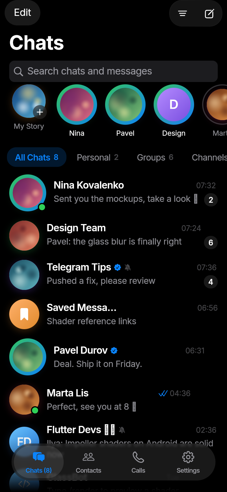
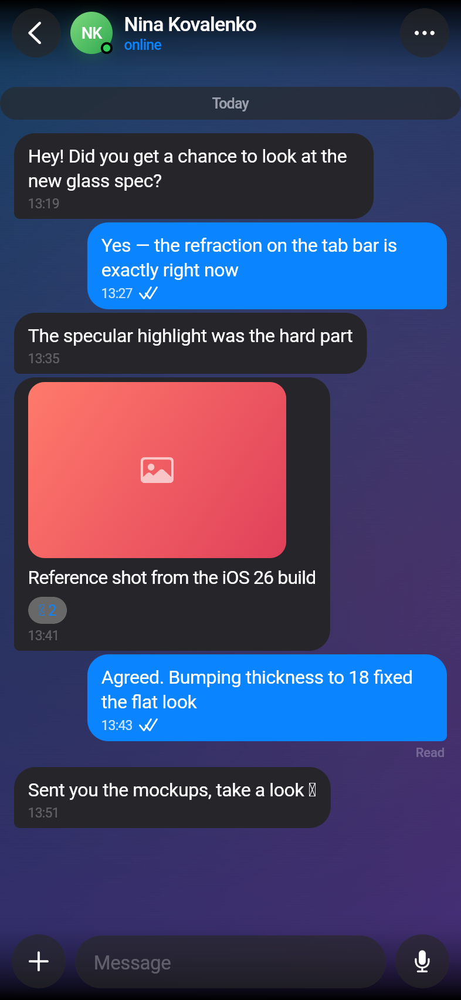
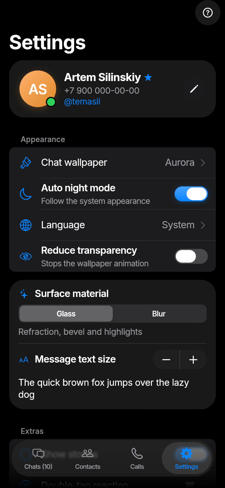
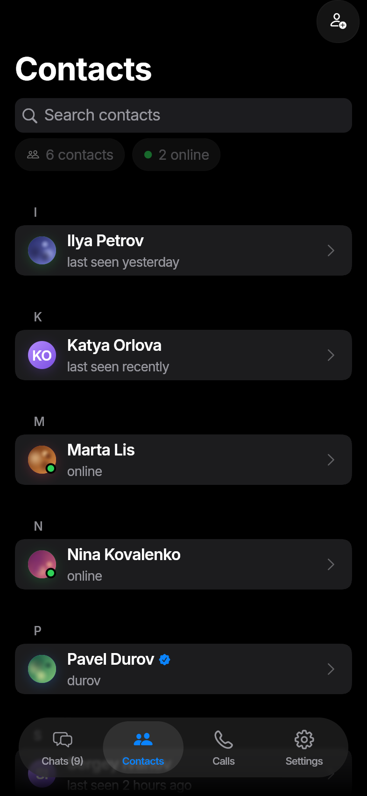
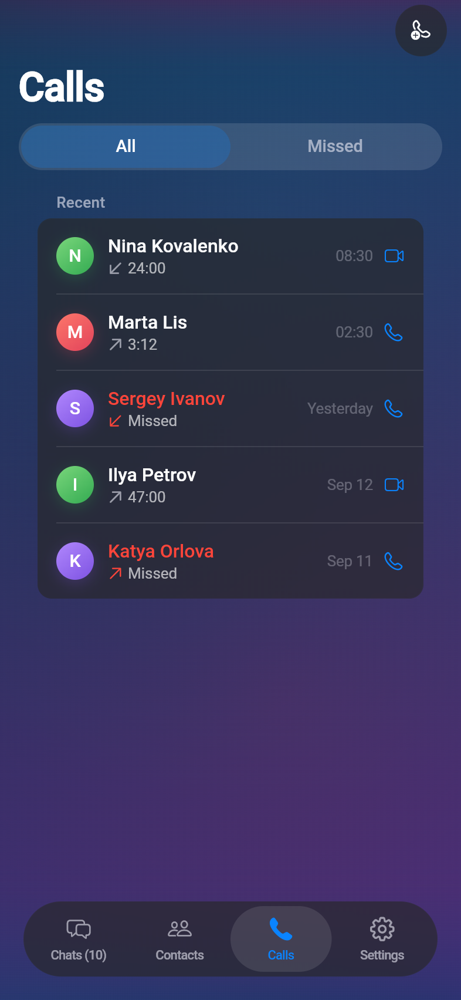
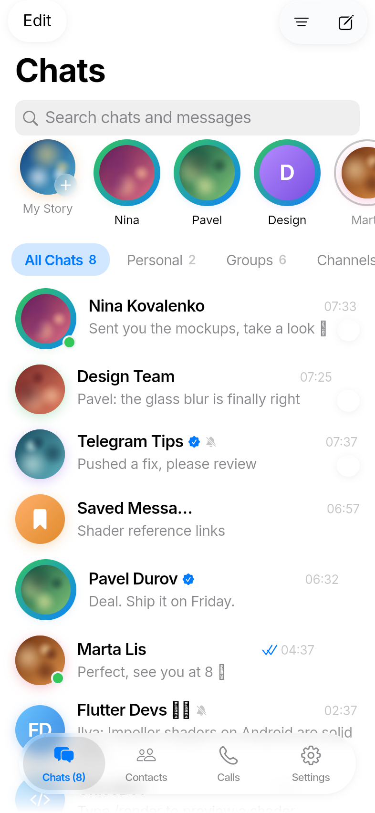

# Telegram Liquid

A Flutter Telegram client for Android that presents as a native iOS app: stock
Cupertino controls throughout, with Apple's iOS 26 *Liquid Glass* material —
via [`liquid_glass_widgets`](https://pub.dev/packages/liquid_glass_widgets) —
on the chrome that floats above content.

It talks to real Telegram servers through the official TDLib JSON interface
over `dart:ffi`, and falls back to a generated demo account when credentials or
the native library are missing.

## What it looks like

<table>
  <tr>
    <td align="center"><br><sub>Chats</sub></td>
    <td align="center"><br><sub>Conversation</sub></td>
    <td align="center"><br><sub>Settings</sub></td>
  </tr>
  <tr>
    <td align="center"><br><sub>Contacts</sub></td>
    <td align="center"><br><sub>Calls</sub></td>
    <td align="center"><br><sub>Light appearance</sub></td>
  </tr>
</table>

> Captured from the **web preview build**, where glass falls back to the
> package's lightweight renderer — Impeller, and with it the real refraction, is
> Android and iOS only. Layout, colour and chrome are what the app draws; the
> material is richer on a phone. Regenerate with `tool/preview.sh`.

## Design rules

The split is deliberate, and worth stating because it is easy to get wrong in
both directions:

- **Controls are stock Cupertino.** `CupertinoTextField`, `CupertinoButton`,
  `CupertinoListSection.insetGrouped`, `CupertinoListTile`,
  `CupertinoSearchTextField`, `CupertinoSlidingSegmentedControl`,
  `CupertinoActivityIndicator`. Forms are not a place for invented widgets.
- **Glass is for what floats.** Nav bars, the tab bar, sheets, context menus,
  the composer surface, the unread badge — surfaces that sit above scrolling
  content and refract it. Settings can trade the refraction for a plain
  frosted blur, which is what the package renders with no shader at all;
  where the glass surfaces are is the same either way.
- **Bubbles are iMessage's**, not glass: solid blue and grey, with a tail on
  the last message of a run. A translucent bubble makes text fight the
  wallpaper behind it.
- **Custom code only where iOS has no widget and Telegram does have the
  thing**: gradient monogram avatars, delivery ticks, the voice waveform, the
  typing dots, the bubble outline, the chat wallpaper.

Icons are SF Symbols 6 via `flutter_cupertino_symbols`, mapped semantically in
`lib/core/tg_icons.dart`. Apple licenses SF Symbols for Apple platforms;
shipping the font in an Android APK is outside that licence and is a deliberate
choice here. That one file is the swap-back point.

## iOS behaviour

`CupertinoApp` throughout, so page transitions, swipe-back, scroll physics and
modal presentation are the iOS ones. In a conversation: bubbles spring in on a
real `SpringSimulation` from the side they belong to, the last outgoing message
carries a Delivered/Read footnote, double-tap reacts, and **dragging the thread
left reveals per-message timestamps**.

## Running it

Requires Flutter **3.47.3+** (the glass package needs ≥ 3.41 and Impeller).

```bash
flutter pub get
flutter run
```

That starts **demo mode**: a generated account with conversations, typing
indicators, delivery ticks and background traffic. The login code is `12345`;
a phone number ending in `0` also asks for the two-step password `telegram`.

## Live Telegram

Two things are needed. Either one missing drops the app back to demo mode
rather than failing to start, and the login screen says which mode it is in.

**1. Your own API credentials.** Only the account holder can create them: sign
in at [my.telegram.org](https://my.telegram.org) → *API development tools*.
Treat the hash as a secret.

**2. `libtdjson.so` for Android.** TDLib publishes no prebuilt Android
binaries, so `.github/workflows/build-tdlib.yml` compiles it — run that
workflow once (Actions → *Build TDLib* → *Run workflow*). It builds OpenSSL and
TDLib for every Android ABI, takes a bit over an hour, and publishes a
`tdlib-<sha>` release. Every later APK build picks it up automatically.

### CI

Add repository secrets `TELEGRAM_API_ID` and `TELEGRAM_API_HASH`; with both
set and a TDLib release present, `Build APK` produces a live client, and
publishes debug and release APKs as a GitHub release. With neither it produces
the demo build, so forks and pull requests still build.

### Locally

```bash
flutter run \
  --dart-define=TELEGRAM_API_ID=123456 \
  --dart-define=TELEGRAM_API_HASH=your_api_hash
```

### When no code arrives

TDLib speaks MTProto over raw TCP. Where that is filtered the connection sits
in `connectionStateConnecting` forever and no login code is ever sent. The
login screen has a **Diagnostics** sheet — whether the library loaded, whether
credentials were compiled in, every authorization and connection state, every
error — and a **Proxy** sheet next to it for MTProto or SOCKS5.

## Installing builds

Both variants are signed with the committed development key in
`android/keystore`, so a new build installs over the previous one instead of
being rejected for a changed signature, and the CI run number becomes the
`versionCode`. It is a development key with a known password: a store release
needs its own private keystore.

## Project map

```
lib/
  core/          glass tokens, colour and type scale, icons, formatters
  l10n/          English and Russian ARB files
  data/
    models.dart          transport-agnostic view models
    telegram_client.dart backend interface
    demo_client.dart     offline backend
    diagnostics.dart     in-app log
    tdlib/               FFI bindings, live backend, web stub
    app_state.dart       ChangeNotifier state, folders, search, preferences
  ui/
    auth/ shell/ chats/ chat/ contacts/ calls/ settings/ stories/ common/
tool/
  preview.sh           web preview + screenshots
  tdlib_probe.dart     drives the real client against a native libtdjson
```

## Development

```bash
flutter analyze
flutter test
bash tool/preview.sh     # web preview and screenshots
```

`tool/tdlib_probe.dart` runs the actual TDLib backend outside Flutter, which is
how the client's protocol handling can be checked without a device or an
account:

```bash
LD_LIBRARY_PATH=<dir with libtdjson.so> \
  dart run tool/tdlib_probe.dart <api_id> <api_hash>
```

## State of it

Working: login with two-factor; the chat list with the account's own folders,
the archive, stories and context menus; search that asks the server rather than
filtering what is loaded — chats, public chats and message text across every
conversation; conversations with replies, editing, deletion, reactions, drafts,
selection mode and proper forwarding that keeps Telegram's attribution;
formatted text with tappable links and spoilers; unfurled link previews; the
unread divider and jump-to-latest; pinned messages; attachments that really
attach (gallery strip, camera, files); downloaded avatars and photos with a
full-screen viewer; voice notes and music that play, and voice messages you
record by holding the mic; animated stickers in all three of Telegram's formats, custom emoji and
full-screen video; notifications while the app is closed, carried by a
foreground service rather than Firebase; contacts you can add by number, call history, active sessions that can be
signed out, profile editing, a compose flow that finds anyone the server
knows, and settings that persist.

Also, from the Telegram mods: a configurable double-tap reaction, forwarding
without quoting, message details, and a hideable story rail.

Not working yet, in rough order of how much they are missed: group and
channel administration, voting in polls, albums, forum
topics, and calls — which TDLib cannot carry at all and
which need the separate `tgcalls` WebRTC stack.

[ROADMAP.md](ROADMAP.md) has the full account, compared against both the
official client and Nekogram.

## Licence

`liquid_glass_widgets` is MIT-licensed by its author. This client is an
independent project, not affiliated with Telegram. Telegram's terms for
third-party clients ask that you not reuse the Telegram name or logo — the
current app name and icon are placeholders for private use and must change
before any public distribution.
